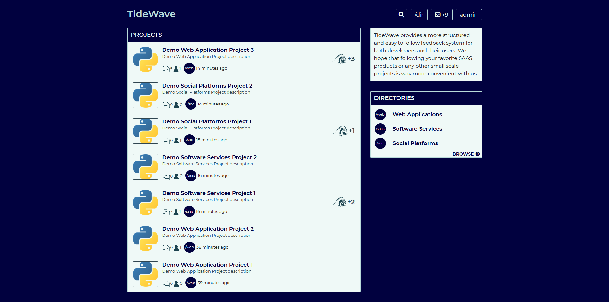
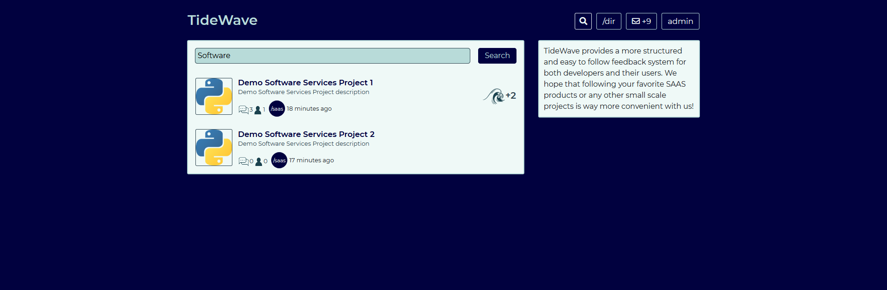
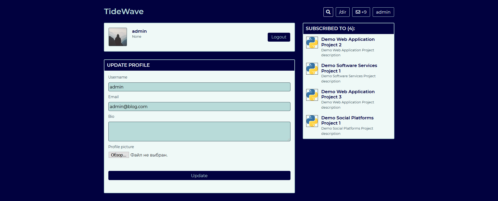

# TideWave
## Flask social web app for developers.



### Overview
The app is designed and written to test out and showcase as many various approaches to routing as possible. 
Homepage loads content asynchronously in an Infinite Scroll manner, same principle might be easily projected on any other requestable content in the future.

There are a couple of other JS library inclusions in the front-end of the app, including: image gallery on project pages, in case there is more than 1 attachment, 
and posting time manipulations to convert timestamps into something way more readable for the users via Moment.JS.


### Installation
Steps described below assume that you have Python 3.6.x+ installed on your computer. I would also recommend to use Python Virtual Environment, which is optional.

1. Clone/Download the files
2. Open terminal of your choice (cmd, GitBash etc) and navigate into the project folder
3. Install project dependencies. This is an example command using **pip**: ```pip install -r requirements.txt```
4. To run application locally run the next command from your terminal while in the project folder : ```python run.py```

### Features
Among many others the application supports full text search through posted projects. This is provided by msearch, which is a continuation on apparently abandoned whoosh.



User profiles are editable and have personal pages which can be viewed by others. Projects and project stages are also editable by the project author.



There is also a notification system that enables tracking those projects that you are subscribed to. 

### Testing
There is a series of tests written using pytest-flask. To run the tests navigate to project folder and use ```python -m pytest```. 
The testing module is assigned to use a local SQLite DB which will be created in the same folder. Testing DB URI is editable through ```/testing/conftest.py```.

